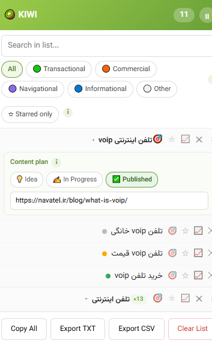
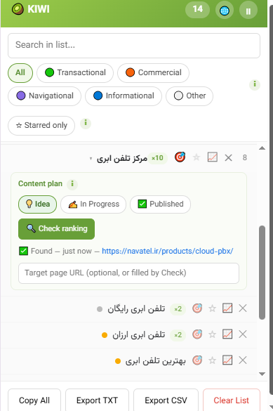

  

<h1 align="center">🥝 KIWI — Keyword Research, Straight From Google</h1>

  A free Chrome extension that turns your everyday Google searches into an organized,
  ready-to-use keyword list — no paid tools, no manual copy-pasting.

---

## What is KIWI?

Every time you search something on Google, it shows you a box of related searches — "People also
search for," "Related searches," and similar sections. Most of us scroll right past them. KIWI
quietly collects those suggestions in the background while you browse normally, organizes them by
topic and search intent, and gives you a clean, exportable keyword list — for free.

No API keys. No subscriptions. No copy-pasting into a spreadsheet by hand.

---

## Installation

KIWI isn't on the Chrome Web Store yet, so you'll install it manually — it only takes a minute:

1. Download and unzip the KIWI folder.
2. Open Chrome and go to `chrome://extensions`.
3. Turn on **Developer mode** (top-right toggle).
4. Click **Load unpacked** and select the unzipped `kiwi-extension` folder.
5. Done — you'll see the 🥝 icon appear next to your address bar.

---

## How it works, in short

1. Go to Google and search like you normally would.
2. KIWI automatically reads the "People also search for" / "Related searches" boxes on the page
   and saves anything new to your list — no clicking required.
3. Click the 🥝 icon any time to see everything you've collected, organized and ready to export.

That's it. The more you search, the bigger — and more useful — your list gets.

---

## Features

### 🔎 Automatic, hands-free collection

Just search normally. KIWI watches every Google results page you visit and saves new suggestions
in the background. It never saves the word you actually typed — only the *suggestions* Google
shows you, so your list fills up with fresh, related ideas instead of duplicates of your own
searches.

### 🗂️ Organized by topic

Instead of one giant flat list, KIWI groups keywords under the search that produced them. Click a
topic to expand it and see everything collected underneath it.

  

### 🎯 Search intent, color-coded automatically

Every keyword is automatically tagged with one of four standard SEO intents, so you instantly know
what kind of content it needs:

| Color | Intent | What it means | Example |
|---|---|---|---|
| 🟢 Green | **Transactional** | Ready to buy/act now | "buy cloud PBX" |
| 🟠 Orange | **Commercial** | Comparing options | "best VoIP phone" |
| 🟣 Purple | **Navigational** | Looking for a specific brand/site | "Snapp login" |
| 🔵 Blue | **Informational** | Wants to learn something | "what is VoIP" |
| ⚪ Gray | **Other** | Doesn't clearly fit the above | — |

Use the colored filter buttons at the top to instantly show only one type — handy when you're
planning, say, only your product pages (Transactional) or only your blog topics (Informational).

You can also teach KIWI your own industry's brand names (competitors, marketplaces, etc.) so they
get tagged as Navigational correctly — just click the 🌐 button in the header.

### ⭐ Star your priorities

Not every keyword is worth acting on. Click the star next to any keyword (or an entire topic) to
mark it as a priority. Use the **"Starred only"** filter to instantly see just your shortlist.

### 🔁 Frequency badge

If the same keyword shows up under several different searches, KIWI doesn't list it twice — it
shows a small **×N** badge instead. The higher the number, the more consistently Google is
surfacing that phrase, which is a strong free signal of real demand.

### 📝 Content plan (status + target page)

Click the 🎯 icon next to any keyword — or an entire topic — to open its content plan:

- Mark it as **💡 Idea → ✍️ In Progress → ✅ Published**, so you always know what's already covered.
- Add the **target page URL** it's meant for (or let KIWI fill it in for you — see below).

  

### 🏆 Automatic rank checking (does your site already rank?)

This is KIWI's most powerful feature. Set your domain once (🌐 button in the header), then click
**"Check ranking"** on any keyword. KIWI quietly opens a background tab, checks Google's results
for your domain, grabs the *exact* URL(s) that are ranking, and reports back — all without
interrupting what you're doing.

- ✅ **Found** → shows the exact page(s) of yours that rank, as clickable links.
- ❌ **Not found** → you know it's a genuine content gap worth targeting.

A small 🏆 icon appears right next to any keyword you already rank for, so you can spot it at a
glance without opening the panel.

### 📈 Quick Google Trends check

Click the chart icon next to any keyword to open Google Trends in a background tab and compare its
relative popularity — no API key needed, completely free.

### ⏸️ Pause anytime

Don't want KIWI collecting while you're doing unrelated searches? Click the pause button in the
header. Nothing gets saved until you resume.

### 📤 Export whenever you want

- **Copy All** — instantly copy every keyword to your clipboard.
- **Export TXT** — a plain list, one keyword per line.
- **Export CSV** — a full spreadsheet with intent, frequency, status, target URL, ranking results,
  and topic groupings — opens correctly in Excel with proper support for non-English text.

---

## A few honest notes

- KIWI reads Google's page structure to find suggestions. Google changes that structure from time
  to time, which can occasionally affect what gets collected — if something looks off, it may just
  need an update.
- The rank-checking feature opens background tabs to check results — please avoid checking dozens
  of keywords back-to-back in a few seconds, to keep things running smoothly.
- Everything is stored locally in your browser. Nothing is sent to any server.

---

## Questions, feedback, or want to collaborate?

I'd love to hear from you — bug reports, feature ideas, or just to say hi:
**[Connect with me on LinkedIn](https://www.linkedin.com/in/behnaz-keshavarz/)**
